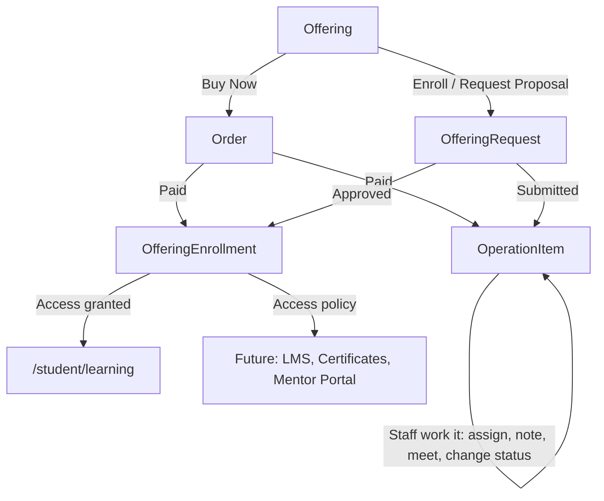
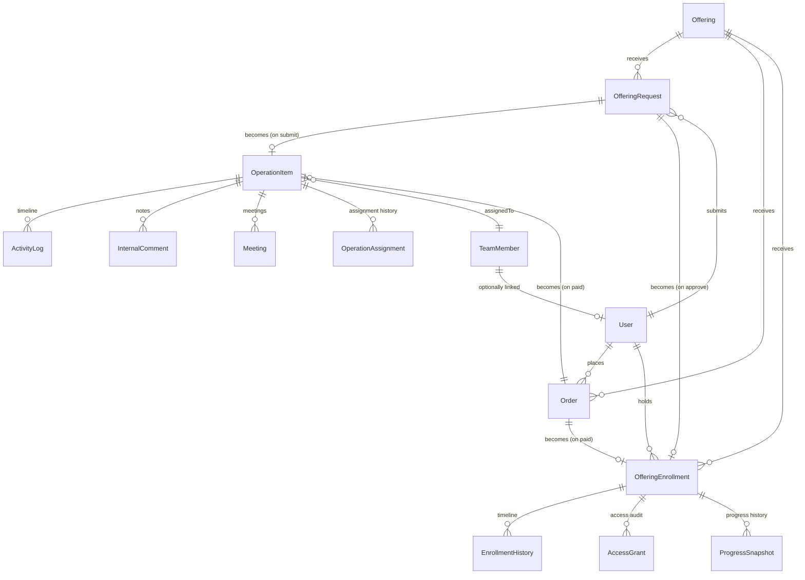
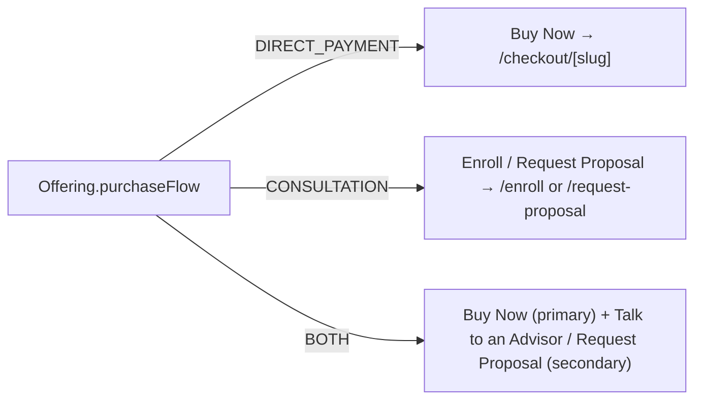
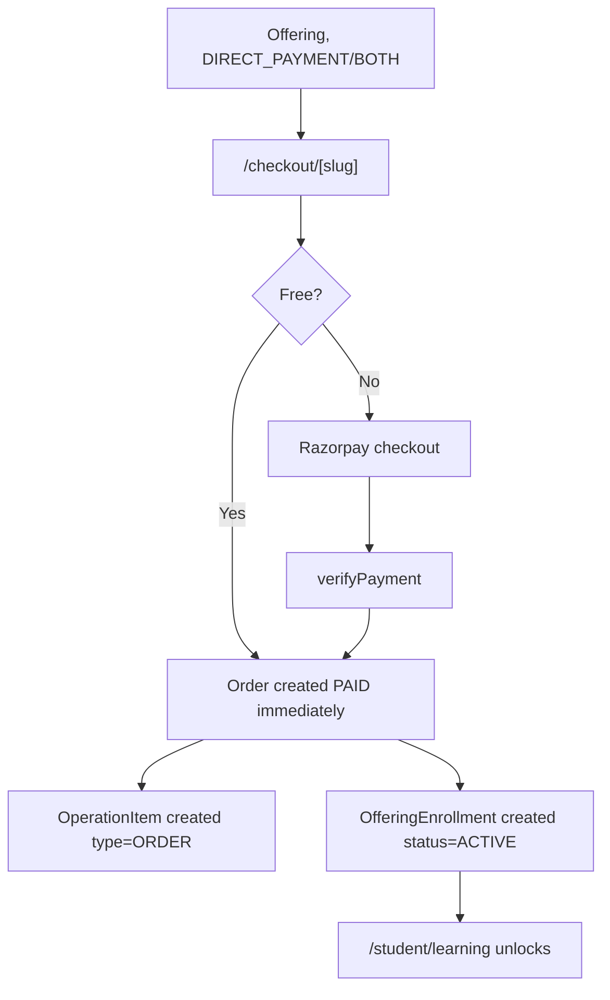
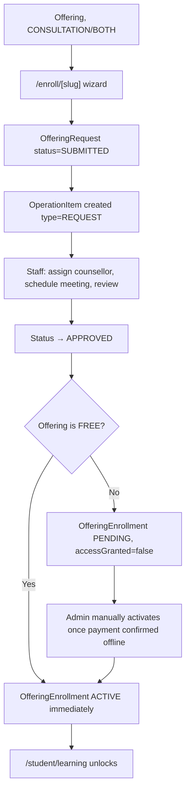
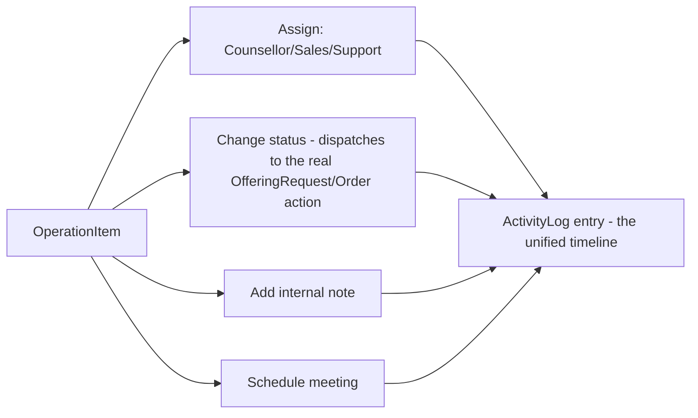

# Stively — System Architecture Document

**Status:** Living document, current through Phase 8 (Student Enrollment & Access Engine).
**Purpose:** The technical blueprint for the platform — every model, every route, every workflow, and every place a future phase is meant to plug in. Read this before touching schema or adding a new feature module.

---

## 1. Overview

Stively is a Next.js 16 (App Router) SaaS platform serving four kinds of visitor: prospective students, businesses, internal staff, and (eventually) mentors. The system is built **feature-first**: each major capability lives in `src/features/<name>/` with its own `lib/`, `validation/`, `server/`, `actions/`, `components/`, and `types/`, rather than being scattered across a generic `components/`/`lib/` tree.

**Stack**

| Layer | Choice |
|---|---|
| Framework | Next.js 16, App Router, React Server Components |
| Language | TypeScript (strict) |
| Styling | Tailwind CSS + shadcn/ui primitives (`src/components/ui/`) |
| Database | PostgreSQL (Neon), accessed via Prisma ORM |
| Auth | Auth.js (NextAuth) — Credentials + Google OAuth |
| Payments | Razorpay (orders + webhook) |
| Validation | Zod, at every server action boundary |
| Mutations | Server Actions (`"use server"`), not a separate API layer |

**Core architectural principle carried through every phase:** *one reusable entity per concept, not one table per feature.* Training, internships, software development, AI solutions, digital marketing, and every future product line are all one `Offering` row with a different `category` — not six separate tables. The same discipline repeats at every layer above it (see §3).

---

## 2. The Business Engine, End to End



Every customer-facing action ultimately traces back to one `Offering` row. From there, the path splits by **purchase flow** (`DIRECT_PAYMENT` vs `CONSULTATION`, or `BOTH`), converges again at the **Operations layer** (staff visibility), and converges a second time at the **Enrollment/Access layer** (customer-facing unlock). This double convergence — one queue for staff regardless of origin, one access gate for customers regardless of origin — is the single most important structural decision in the codebase.

---

## 3. Two Parallel Systems (read this before changing schema)

The codebase deliberately runs **two independent systems side by side** in two places. This is not accidental duplication — it's the safe way to introduce a new architecture without rewriting a live one, and it's been the explicit call at every phase boundary where it came up.

### 3.1 `Program` vs `Offering`

| | Legacy | Current |
|---|---|---|
| Model | `Program` | `Offering` |
| Powers | `/training`, `/training/[slug]` | `/offerings`, `/offerings/[slug]`, checkout, requests, operations, enrollment |
| Enrollment model | `Enrollment` (→ `Program`) | `OfferingEnrollment` (→ `Offering`) |
| CRM link | `Lead.programId` | *(none — Offerings don't feed Lead)* |

`Program`/`Enrollment` are untouched and still live (real, if unused, rows may exist). Migrating Training onto `Offering` and redirecting `/training` → `/offerings/training` is a deliberate future migration, not bundled into any phase so far.

### 3.2 `Lead` (CRM) vs `OperationItem` (Operations)

| | Legacy | Current |
|---|---|---|
| Model | `Lead` | `OperationItem` |
| Source | Contact form, careers, newsletter popup | `OfferingRequest` (submitted), `Order` (paid) |
| Timeline | `LeadHistory` | `ActivityLog` |
| Notes | `LeadNote` | `InternalComment` |
| Assignment | `LeadAssignment` → `TeamMember` | `OperationAssignment` → `TeamMember` |
| UI | `/admin/leads` | `/admin/operations` |

Both share the **same staff identity** (`TeamMember`) and the same `(dashboard)` route group/sidebar, but the two work-item systems are not merged. Unifying them (if ever) is a deliberate future migration.

**Rule of thumb:** if you're about to add a field or table that seems like it duplicates something above, check whether it's actually the same concept crossing a system boundary before assuming it's redundant.

---

## 4. Database Schema

Full source of truth: [`prisma/schema.prisma`](../prisma/schema.prisma). This section is the organized map of it.

### 4.1 Auth & Identity

| Model | Purpose |
|---|---|
| `User` | The one login identity for every role. `role: Role` gates portal access. |
| `Account`, `Session`, `VerificationToken` | Auth.js adapter tables. |
| `PasswordResetToken`, `EmailVerificationToken` | App-issued single-use tokens (Credentials flow). |
| `TeamMember` | **Staff identity**, distinct from `User`. Optionally linked via `TeamMember.userId`. Owns CRM leads *and* Operations assignments *and* Enrollment access grants. |

```
enum Role { STUDENT MENTOR CLIENT COMPANY INTERN TEAM_MEMBER ADMIN SUPER_ADMIN }
enum TeamMemberRole { FOUNDER SALESPERSON ADMIN COUNSELLOR SUPPORT }
```

`Role` is the **portal** gate (which route prefix you can enter). `TeamMemberRole` is a **finer-grained staff capacity** used only inside Operations/CRM to decide "see everything" vs "see only my assignments" (see §7).

### 4.2 Legacy: Training Programs & CRM

| Model | Purpose |
|---|---|
| `Program` | Legacy training catalog. Powers `/training`. |
| `Enrollment` | Legacy, → `Program`. `EnrollmentStatus { PENDING PAID COMPLETED CANCELLED }` |
| `Lead` | Contact-form/careers/newsletter capture. Own full CRM: `LeadHistory`, `LeadNote`, `LeadAssignment`. |
| `NewsletterSubscriber`, `Testimonial` | Standalone, self-explanatory. |

### 4.3 Offerings Platform (Phase 4)

**`Offering`** — the one product catalog entity for every product line.

```
enum OfferingCategory { TRAINING INTERNSHIP SOFTWARE_DEVELOPMENT WEBSITE_DEVELOPMENT
                         MOBILE_DEVELOPMENT AI_SOLUTIONS DIGITAL_MARKETING
                         CAREER_GUIDANCE CORPORATE_TRAINING SAAS }
enum OfferingAudience { STUDENT BUSINESS BOTH }
enum OfferingStatus   { DRAFT PUBLISHED ARCHIVED COMING_SOON }
enum PricingType      { FREE FIXED SUBSCRIPTION CUSTOM_QUOTE }
enum Difficulty        { BEGINNER INTERMEDIATE ADVANCED }
enum Mode               { ONLINE OFFLINE HYBRID }
enum PurchaseFlow       { DIRECT_PAYMENT CONSULTATION BOTH }   // Phase 6
```

Key fields beyond the obvious: `viewCount` (real "Popular" sort signal), `faqs`/`curriculum` (`Json`, Zod-validated — same convention as `Program.syllabus`), `createdById`/`updatedById` (audit trail), `purchaseFlow` (decides which CTA(s) render — see §8.1).

Future relations intentionally **not** modeled as real tables yet: Instructor/Mentor (today: `instructorName` string), Testimonial (today: a placeholder UI section), FAQ/Module/Resource/Document (today: `Json` fields), Tag (today: `String[]`).

### 4.4 Offering Request Engine (Phase 5)

**`OfferingRequest`** — the one workflow for "I need guidance/scoping before I buy." A Student clicking Enroll and a Business clicking Request Proposal both create this, differing only by `requestType`.

```
enum RequestType     { STUDENT BUSINESS }
enum RequestStatus   { DRAFT SUBMITTED UNDER_REVIEW COUNSELLING_SCHEDULED
                        WAITING_FOR_PAYMENT APPROVED REJECTED CANCELLED COMPLETED }
enum RequestPriority { LOW MEDIUM HIGH URGENT }
enum PaymentStatus   { NOT_REQUIRED PENDING PAID REFUNDED }
enum PreferredContactMethod { EMAIL PHONE WHATSAPP GOOGLE_MEET ZOOM }
```

`details: Json` holds the wizard's step data (one flexible field, not a `studentDetails`/`businessDetails` pair). `currentStep` is both the wizard's resume point and what a Draft's list card shows. `OfferingRequestHistory` is the append-only Status Timeline (`RequestEventType`).

### 4.5 Orders & Checkout (Phase 6)

**`Order`** — the one-click Razorpay checkout path, separate from `OfferingRequest` on purpose (see §3-style reasoning in the model comment).

```
enum OrderStatus { PENDING PAID FAILED CANCELLED REFUNDED }
```

`amount` is snapshotted in paise at purchase time (never re-derived from `Offering.price` later). `razorpayOrderId`/`razorpayPaymentId`/`razorpaySignature` back the verification flow (`src/lib/razorpay.ts`).

### 4.6 CRM & Operations Engine (Phase 7)

**`OperationItem`** — a thin pointer + operational metadata row over exactly one `OfferingRequest` **or** one `Order` (never both, never neither in practice — enforced in code, not a DB constraint). It does **not** duplicate status; `OfferingRequest.status`/`Order.status` stay the real source of truth.

```
enum OperationItemType  { REQUEST ORDER }
enum OperationPriority  { LOW MEDIUM HIGH URGENT }
enum AssignmentRole     { COUNSELLOR SALES SUPPORT MENTOR }   // MENTOR: no TeamMemberRole exists yet
enum ActivityType       { CREATED ASSIGNED REASSIGNED STATUS_CHANGED PRIORITY_CHANGED
                           DUE_DATE_CHANGED MEETING_SCHEDULED PAYMENT_RECEIVED
                           NOTE_ADDED COMPLETED }
enum MeetingStatus      { SCHEDULED COMPLETED CANCELLED NO_SHOW }
```

Supporting models: `OperationAssignment` (append-only, mirrors `LeadAssignment`), `ActivityLog` (the unified timeline), `InternalComment` (staff-only notes), `Meeting` (real scheduling record, no calendar/video integration).

An `OperationItem` is only created once a Request is **Submitted** or an Order is **Paid** — never for an abandoned Draft or a Pending checkout.

### 4.7 Enrollment & Access Engine (Phase 8)

**`OfferingEnrollment`** — turns a Paid Order or an Approved Request into actual customer access. Named distinctly from the legacy `Enrollment` (see §3.1).

```
enum OfferingEnrollmentStatus { PENDING ACTIVE PAUSED COMPLETED CANCELLED EXPIRED }
enum EnrollmentEventType      { CREATED ACTIVATED PAUSED RESUMED COMPLETED CANCELLED
                                 EXPIRED EXTENDED ACCESS_GRANTED ACCESS_REVOKED PROGRESS_UPDATED }
enum AccessGrantReason        { PAYMENT_CONFIRMED ADMIN_APPROVED FREE_OFFERING
                                 MANUAL_OVERRIDE POLICY_VIOLATION EXPIRED SUBSCRIPTION_ENDED }
```

Supporting models: `EnrollmentHistory` (Timeline), `AccessGrant` (audit trail of *why* access changed — the concrete form of the Access Policy concept, see §7.3), `ProgressSnapshot` (historical record for a future progress chart; `OfferingEnrollment.progressPercentage`/`currentModule` stay the cheap "current value" columns).

**Origin rule, worth restating because it's not obvious from the field list alone:** an Order-originated enrollment is always created `ACTIVE` (payment is proof enough). A Request-originated enrollment is only `ACTIVE` immediately if the offering is `FREE`; otherwise it's created `PENDING` with `accessGranted: false`, because request-side online payment doesn't exist yet — an admin activates it manually (from the Operations detail page) once payment is confirmed offline.

### 4.8 Full Relationship Map (Phase 4–8 core)



---

## 5. Feature Modules (`src/features/`)

Every feature follows the same internal shape. Not every feature needs every folder.

```
src/features/<name>/
  lib/          pure helpers - number formatters, label maps, event-emission stubs
  validation/   Zod schemas for filters and form input
  server/       queries.ts (reads), creation.ts (the shared "how this gets created" core), actions live in actions/
  actions/      "use server" mutations - both customer-facing and admin (unwired)
  components/   feature-scoped React components
  hooks/        feature-scoped client hooks (URL-driven filter state, etc.)
  types/        re-exported public types for the feature
```

| Feature | Wraps | Key files |
|---|---|---|
| `offerings` | `Offering` | `server/queries.ts` (catalog, filters, audience queries), `lib/purchase-cta.ts` (CTA decision logic), `actions/offering-admin-actions.ts` (unwired CMS prep) |
| `offering-requests` | `OfferingRequest` | `components/wizard/` (multi-step request flow), `lib/steps-config.ts` (config-driven step definitions), `actions/admin-request-actions.ts` |
| `orders` | `Order` | `actions/order-actions.ts` (`createOrder`, `verifyPayment`), `components/checkout-button.tsx` (Razorpay client glue) |
| `operations` | `OperationItem` + friends | `server/rbac.ts` (`resolveOperationsViewer`), `lib/stage-labels.ts` (per-type status label mapping), `components/operation-detail-view.tsx` |
| `enrollments` | `OfferingEnrollment` + friends | `server/access-policy.ts` (**the Access Policy**), `server/creation.ts` (`createEnrollmentFromOrder`/`createEnrollmentFromRequest`), `components/my-learning-view.tsx` |

**Cross-feature integration points** (deliberately thin, one call each, always non-fatal at the call site):

- `offering-requests/actions/request-actions.ts`'s `submitRequest` → `operations/server/creation.ts`'s `createOperationItemForRequest`
- `offering-requests/actions/admin-request-actions.ts`'s `approveRequest`/`updateRequestStatus` → `enrollments/server/creation.ts`'s `createEnrollmentFromRequest`
- `orders/actions/order-actions.ts`'s `verifyPayment`/free-path/webhook → `operations`'s `createOperationItemForOrder` **and** `enrollments`'s `createEnrollmentFromOrder`
- `operations/actions/operation-actions.ts`'s `assignOperationItem`/`changeOperationStatus` → re-invokes `offering-requests`'s own `assignCounsellor`/`assignSalesPerson`/`updateRequestStatus` (reused, not duplicated) or `orders`'s `updateOrderStatusAdmin`

---

## 6. Route Map

### 6.1 Public / Marketing — `(marketing)` route group

```
/                          Home
/about, /services, /pricing, /contact
/training, /training/[slug]              Legacy Program catalog
/offerings, /offerings/[slug]             Offering catalog + detail (slug resolves to
                                           either a category archive or a single offering)
```

### 6.2 Auth — `(auth)` route group

```
/login  /register  /forgot-password  /reset-password  /verify-email
```

### 6.3 Task-flow routes — minimal-chrome, top-level (not nested under marketing or portal)

```
/enroll/[slug]              Student request wizard
/request-proposal/[slug]    Business request wizard
/checkout/[slug]            Direct-purchase checkout
```

All three inline-check `auth()` (redirect to `/login?callbackUrl=...`), then gate on the offering's `audience`/`purchaseFlow`.

### 6.4 Portal — `(portal)` route group, per-role dashboards

```
/student/dashboard, /student/learning, /student/requests(/[id]), /student/orders(/[id]),
/student/internships, /student/career-guidance, /student/saved-programs, /student/blogs, /student/support
/client/dashboard, /client/requests(/[id]), /client/orders(/[id]), /client/projects, /client/invoices
/mentor/dashboard  /company/dashboard  /intern/dashboard  /team/dashboard    (placeholder shells)
```

### 6.5 Internal CRM — `(dashboard)` route group

```
/admin/dashboard        Lead CRM overview (KPIs, recent leads, follow-ups, activity feed)
/admin/leads(/[id])     Lead detail (timeline, notes, owner panel)
/admin/operations(/[id]) Operations Engine — the Phase 7/8 work queue
/admin/students  /admin/businesses  /admin/reports  /admin/settings
/ceo/dashboard          Super Admin landing - cross-cutting KPIs + links into /admin
```

### 6.6 Standalone

```
/profile  /settings  /help          Role-agnostic, self-wrap in DashboardShell
/unauthorized                       RBAC bounce target
/api/auth/[...nextauth]             Auth.js
/api/webhooks/payment               Razorpay webhook
```

---

## 7. Dashboard Hierarchy & RBAC

### 7.1 Two shells

| | `(portal)` | `(dashboard)` |
|---|---|---|
| Who | STUDENT, CLIENT, MENTOR, COMPANY, INTERN, TEAM_MEMBER | ADMIN, SUPER_ADMIN |
| Shell | `DashboardShell` (config-driven sidebar, `src/config/navigation/`) | `DashboardSidebar` (hardcoded `NAV_ITEMS` array) |
| Gate | `src/proxy.ts` (edge) + `requireRole` per-page (defense in depth) | `(dashboard)/layout.tsx`'s single `requireRole("ADMIN","SUPER_ADMIN")` |

Adding a new portal role: one `Role` enum value + one migration + one line each in `ROLE_HOME`/`ROLE_LABEL`/`PROTECTED_ROUTES` (`src/config/rbac.ts`) + one `NavigationConfig` file + one line in `ROLE_NAVIGATION` (`src/config/navigation/index.ts`) + a route folder.

### 7.2 RBAC matrix

| Role | Portal home | Can reach |
|---|---|---|
| `STUDENT` | `/student/dashboard` | `/student/*` only |
| `CLIENT` (Business) | `/client/dashboard` | `/client/*` only |
| `MENTOR` / `COMPANY` / `INTERN` / `TEAM_MEMBER` | own `/*/dashboard` | own prefix only |
| `ADMIN` | `/admin/dashboard` | `/admin/*` |
| `SUPER_ADMIN` | `/ceo/dashboard` | `/admin/*` **and** `/ceo/*` (superset) |

Enforced twice: `src/proxy.ts` (edge middleware, the fast real gate) and `requireRole()`/the `(dashboard)` layout (defense in depth inside the render).

### 7.3 Finer-grained: Operations viewer scoping

Inside `/admin/operations`, portal `Role` alone isn't enough — `resolveOperationsViewer()` (`src/features/operations/server/rbac.ts`) adds a second layer keyed off `TeamMemberRole`:

| Linked `TeamMember.role` | Sees |
|---|---|
| `SUPER_ADMIN` (portal role) | Everything, unconditionally |
| `FOUNDER` or `ADMIN` | Everything |
| `COUNSELLOR` / `SALESPERSON` / `SUPPORT` | Only `OperationItem`s where `assignedToId` is theirs |
| Not linked to any `TeamMember` | Everything (fallback — an unlinked admin never regresses) |

This scoping is enforced **in the query layer** (`getOperationItems`/`getOperationItemById`), not just hidden in the UI.

### 7.4 The Access Policy (Enrollments)

`src/features/enrollments/server/access-policy.ts` is the CEO-requested centralization: every access question (`canAccessLearning`, `canDownloadResources`, `canViewCertificates`, `canViewMentor`, `isExpired`) is answered by one function, not by inline `if (enrollment.status === ...)` checks scattered across pages. **Every future feature (real LMS, certificates, mentor portal, an AI assistant) should call this, not inspect `OfferingEnrollment` fields directly** — that's the one place subscriptions/scholarships/trial access get added later.

---

## 8. Business Workflows

### 8.1 CTA decision (which button a visitor even sees)



Computed once in `src/features/offerings/lib/purchase-cta.ts`, consumed by both the multi-button `OfferingCTA` component and the single-button closing CTA on the offering detail page.

### 8.2 Student — Direct Purchase



### 8.3 Student — Consultation



### 8.4 Business — Request Proposal

Same shape as §8.3 with `requestType=BUSINESS`, landing in `/client/requests`. No enrollment path is wired for Business — `OfferingEnrollment.studentId` is a `User`, and the Business "becomes a customer" outcome is a future `Project` model (Phase 10 on the roadmap), not built yet.

### 8.5 Staff working an item (Operations)



---

## 9. Data Flow Summary

| Event | Writes | Reads that change as a result |
|---|---|---|
| Offering published | `Offering.status = PUBLISHED` | `/offerings` listing, sitemap |
| Request submitted | `OfferingRequest`, `OfferingRequestHistory`, `OperationItem`, `ActivityLog` | `/student\|client/requests`, `/admin/operations` |
| Order paid | `Order`, `OperationItem`, `ActivityLog`, `OfferingEnrollment`, `EnrollmentHistory`, `ProgressSnapshot` | `/student\|client/orders`, `/admin/operations`, `/student/learning`, dashboard |
| Request approved | `OfferingRequest.status`, `OfferingRequestHistory`, `OfferingEnrollment` (PENDING or ACTIVE) | `/admin/operations` (Enrollment card), possibly `/student/learning` |
| Admin activates enrollment | `OfferingEnrollment.status/accessGranted`, `EnrollmentHistory`, `AccessGrant` | `/student/learning`, dashboard "Continue Learning" |

---

## 10. Future Extension Points (consolidated across phases)

These are places the codebase already prepared for, without building the feature itself:

- **Program → Offering migration**: unify the legacy Training catalog into the Offerings platform; redirect `/training` → `/offerings/training`.
- **Lead → OperationItem unification**: fold the contact-form CRM into the Operations queue, or formally decide they stay separate.
- **Real LMS**: lessons, modules, video — `OfferingEnrollment.currentModule`/`progressPercentage` and `ProgressSnapshot` are the data layer waiting for it.
- **Certificates**: `src/features/certificates/**` - `AccessPolicy.canViewCertificates` (`status === COMPLETED`) gates issuance; PDF is never stored, rendered on demand from the `Certificate` row on every view/download; public verification at `/verify/[certificateId]`. See AD-019.
- **Mentor system**: `AssignmentRole.MENTOR` and `OfferingCTA`'s mentor placeholder exist; no `TeamMemberRole.MENTOR`, no mentor portal.
- **Business Projects** (Phase 10 on roadmap): the Business-side equivalent of `OfferingEnrollment` — nothing built yet.
- **Payments-for-Requests**: online payment collection on the Consultation path (today: offline, admin-confirmed via `activateEnrollment`).
- **Subscriptions / scholarships / trial access**: `AccessGrantReason` already has non-payment reason codes (`SUBSCRIPTION_ENDED`, etc.) waiting for the flows that would use them.
- **Real notifications/email**: every `lib/events.ts` (`offering-requests`, `orders`, `enrollments`) is a logged stub at the one call site each event fires from — wiring a provider in is a body-only change, not a new call-site hunt.
- **Admin CMS**: `offering-admin-actions.ts`, `admin-request-actions.ts`, `admin-enrollment-actions.ts` are all real, `requireRole`-guarded, and completely unwired from any UI beyond the Operations detail page.
- **CEO analytics**: Revenue and Conversion Rate on `/ceo/dashboard` are explicit "Coming soon" placeholders — no fabricated numbers, no analytics pipeline yet.

---

## 11. Conventions Worth Preserving

- **Derived reference numbers, never stored**: `REQ-`, `ORD-`, `OPS-`, `ENR-` are all `formatXNumber(sequence)` over an `Int @unique @default(autoincrement())` column — never a redundant text field that could drift.
- **Non-fatal cross-feature integration**: every "create the next thing" call (`createOperationItemForRequest`, `createEnrollmentFromOrder`, etc.) is wrapped in try/catch at the call site — a failure to create the downstream record must never block the primary action that triggered it.
- **Ownership scoping in the query layer, not the page**: every `getXById(id, userId)` returns `null` for "not found" and "not yours" identically — never a different error that would leak existence.
- **Json + Zod for flexible-but-validated content**: `Offering.faqs/curriculum`, `OfferingRequest.details` — parsed and validated at read time, never trusted as typed.
- **Anti-fabrication discipline**: every "coming soon" surface (testimonials, certificates, CEO revenue widgets) is an honest empty state, never a fake number or fabricated quote.
